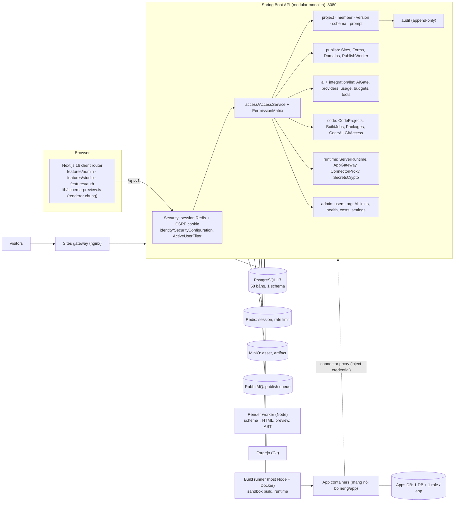

# Đánh giá kiến trúc hiện tại và kiến trúc V2 (2026-10-05)

Mọi kết luận dưới đây dựa trên code, schema Flyway V1–V25 (đối chiếu với DB đang chạy) và tài liệu trong repo. Chỗ nào không tìm thấy trong code thì ghi
**“KHÔNG CÓ”**; không suy đoán. Đường dẫn backend: `backend/src/main/kotlin/com/systemwebstudio/…` (viết tắt `…/`).

## 1. Tóm tắt hệ thống hiện tại

* Là **modular monolith** Kotlin/Spring Boot (20 package, 105 file `.kt` (~12,3 nghìn dòng), 25 migration) + **Next.js 16** client-router (một UI, hai vỏ: Admin Console và Builder Studio)
  + các “plane” chạy ngoài JVM: render worker (Node), build runner (Node + Docker), Forgejo (Git), nginx gateway (site / app), container app do người dùng sinh.
* Đơn vị tổ chức thực tế là **Workspace** trong **một công ty duy nhất** (một deployment = một công ty). **KHÔNG CÓ khái niệm Tenant** (không có bảng `tenants`, không có cột `tenant_id`, grep “tenant” = 0 kết quả).
  Cô lập dữ liệu theo `workspace_id` ở tầng ứng dụng (không có PostgreSQL RLS: `relrowsecurity` = 0 bảng).
* “App” = bảng `projects` (1799 dòng trên DB dev) với hai biểu diễn hoàn toàn khác nhau: **PAGE_SCHEMA** (metadata JSON, website/trang, do AI/Design chỉnh bằng *operation* có kiểu)
  và **STATIC_APP** (mã nguồn trong Git: web app, dashboard, internal tool, workflow, server app — build trong sandbox, chạy trong container cô lập có DB riêng).
* Điểm mạnh nổi bật: AI **không bao giờ** sinh mã cho website (chỉ sinh operation → validate → commit version), AI gateway có governance đầy đủ (quyền model, ngân sách, hạn mức, audit),
  bảo mật triển khai chặt (CSRF, 404 thay vì 403, SSRF guard, secret AES-GCM write-only, sandbox/runtime cô lập, audit append-only bằng trigger).
* Điểm thiếu lớn nhất so với mục tiêu của bạn: **không có multi-tenant thật; không có App Model thống nhất; không có Data Source / Query / View Model / Mapping / Transform / Schema Discovery
  cho app dạng metadata; không có Event/Action/Workflow trong metadata; chia sẻ chỉ có “theo người”; không có cross-tenant; chưa có cache/sync/realtime/scheduler nghiệp vụ.**
* Hướng đi khuyến nghị: **giữ modular monolith**, giữ nguyên cả hai “mặt phẳng” hiện có, và bổ sung (1) lớp Tenant, (2) App Definition v2 mở rộng page schema (tương thích ngược),
  (3) Data Layer (DataSource → Query → ViewModel → Mapping) chạy server-side, (4) Action/Workflow runtime đọc metadata, (5) bảng chia sẻ tài nguyên + yêu cầu duyệt. Không cần microservices.

## 2. Sơ đồ kiến trúc hiện tại (theo code)



## 3. Danh sách module (đọc từ code)

| Module (`…/`) | Vai trò | Ghi chú |
|---|---|---|
| `identity` | đăng nhập mật khẩu/OIDC/SAML-qua-broker, SCIM 2.0, MFA ủy quyền IdP, kích hoạt tài khoản bằng link một lần (`Accounts.kt`), bootstrap admin | `SecurityConfiguration`, `Scim.kt`, `oidc/` |
| `access` | RBAC server-side: `PermissionMatrix` (workspace role + project role), `AccessService.forWorkspace/forProject` | 404 thay vì 403 khi không phải thành viên |
| `project`, `member`, `version`, `schema`, `prompt`, `asset`, `component` | vòng đời app dạng PAGE_SCHEMA: schema JSON, `SchemaPatchEngine` (operation), `PageSchemaValidator`, version bất biến, AI prompt, registry component | cốt lõi “UI builder” |
| `publish` | build artifact tĩnh (render worker), PublishWorker (RabbitMQ + hồi phục định kỳ), Sites/Forms/Domains, site riêng tư dùng ticket một lần | |
| `ai`, `integration/llm` | AI gateway: `AiGate` (quyền model → token → ngân sách → quota), `ExternalLLMProvider`, `AiProviderRegistry` + `ProviderStore` (khóa mã hóa), usage/giá/ngân sách/cảnh báo, tool calling | |
| `code`, `integration/git` | app mã nguồn: repo Forgejo, sandbox build, package được duyệt, review trước merge, AI sinh code | |
| `runtime` | app có máy chủ: `ServerRuntimeService`, `AppGatewayController`, `ConnectorProxyController`, `AppDbProvisioner`, `SecretsCrypto` | |
| `template` | template + block đóng góp, quy trình duyệt (PRIVATE→SUBMITTED→REVIEW→APPROVED) | phạm vi PRIVATE/COMPANY |
| `admin`, `settings` | Admin Console API, chính sách chỉnh được (có audit, mục rủi ro cao cần xác nhận), health probe, chi phí | |
| `audit` | `AuditService.record`, bảng `audit_events` có trigger chặn UPDATE/DELETE/TRUNCATE | |
| `maintenance` | sao lưu/monitor, dọn artifact | 3 `@Scheduled` trong toàn hệ thống |
| `common` | rate limiter (Redis), request id, lỗi chuẩn, `ProductionConfigValidator` | |

Frontend: `app/` (Next), `components/app/AppEntry.tsx` (router), `features/*` (UI), `lib/http-api.ts` (client), `lib/schema-preview.ts` (renderer **duy nhất** cho preview và publish).
Workers: `workers/render` (HTML tĩnh, preview ảnh, AST), `workers/runner` (build/runtime). Hạ tầng: `compose.yml`, `infra/`, `scripts/` (34 script).

## 4. Luồng thực tế: Super Admin → … → Publish/Share

```
Operator (BOOTSTRAP_ADMIN_* / scripts/create-first-admin.sh)  → users.system_admin = TRUE   ("Super Admin" hiện tại)
 → Admin Console: tạo Workspace (AccountController /admin/workspaces) — KHÔNG có Tenant
 → "+ Thêm người dùng" → users + workspace_members(role) + link kích hoạt (account_tokens, chỉ lưu hash) → người dùng tự đặt mật khẩu
 → Studio: Create App → POST /workspaces/{ws}/projects → projects(owner_user_id, app_type, app_kind) + project_members(OWNER)
      PAGE_SCHEMA: page_schemas.schema = trang mẫu (hiện là "Pure Living") ; STATIC_APP: repo Forgejo + scaffold theo app_kind
 → UI: Design (chọn/sửa section, dnd-kit) hoặc AI prompt → SchemaPatchEngine (ADD_SECTION/UPDATE_PROP/…) → PageSchemaValidator → project_versions (bất biến)
 → Logic: KHÔNG CÓ trong metadata (chỉ <form> POST tới /sites/{slug}/_forms/{id}); với STATIC_APP/SERVER_APP: logic là code Node trong container
 → Workflow: KHÔNG CÓ engine; app_kind=WORKFLOW chỉ là scaffold code server (phê duyệt/lịch sử do code tự làm)
 → API: /api/v1/** (REST, Spring) ; app server: /<slug>/api/** qua AppGateway, chỉ route khai báo trong openapi.json
 → Data: PAGE_SCHEMA = dữ liệu nằm trong schema/asset/form_submissions ; SERVER_APP = DB riêng mỗi app (appdb) 
 → External System: chỉ server app, qua ConnectorProxy: connectors(base_url, operations allowlist, header xác thực mã hóa) được admin duyệt rồi cấp cho từng project
 → Publish: deployments(visibility PRIVATE|PUBLIC) → artifact tĩnh MinIO → sites gateway ; Share: project_members(VIEWER|EDITOR|PUBLISHER|OWNER) theo từng người
```

## 5. App Model hiện tại

```
projects (id, workspace_id, owner_user_id, app_type[PAGE_SCHEMA|STATIC_APP], app_kind[6 loại], lifecycle, site_visibility, domain…)
 ├─ PAGE_SCHEMA:  page_schemas.schema (jsonb)  = { page, sections[ {id,type,componentVersion,props{…}} ], pages[], site{title,home,navigation[],notFound}, seo }
 │                 └ components/component_versions (registry, props-schema; version bất biến)  · assets · project_versions (snapshot)
 ├─ STATIC_APP:   repositories (Forgejo) · code_changes (review/merge) · build_jobs · artifacts
 │                 └ SERVER_APP/INTERNAL_TOOL/WORKFLOW: app_runtimes (DB+role+token) · server_deployments · project_secrets · project_connectors → connectors
 ├─ Sharing:      project_members (user, role)         Publish: sites(slug) · deployments · site_domains · form_submissions
 └─ KHÔNG CÓ trong metadata: DataSource, Query, ViewModel, Mapping, Action, Event, Workflow, Permission riêng của app, Publish config tách biệt.
```
Kết luận: **chưa có App Model thống nhất**; có hai model song song gắn chung bảng `projects`. Phần metadata (PAGE_SCHEMA) có validator + registry rất sạch nhưng chỉ mô tả *giao diện*.

## 6. Data flow hiện tại

```
Website:  Browser ─(prompt/edit)→ API → SchemaPatchEngine → validator → project_versions
          Publish → RabbitMQ → PublishWorker → render worker (schema→HTML, không script) → MinIO (content-addressed) → sites gateway → visitor
          Visitor form → /sites/{slug}/_forms/{id} (honeypot, rate limit, origin check, IP băm) → form_submissions → Studio xem/CSV
Code app: Studio → Forgejo (ai/ branch, review) → runner sandbox (no network, OSV, gitleaks) → artifact / image → app container
Server app: visitor → sites gateway → API AppGateway → apps gateway (token) → container ─ DB riêng
            container → API /internal/connectors/{key}/** (X-App-Token, allowlist method+path, https, PublicAddress SSRF guard, inject credential) → hệ thống ngoài
```
Browser **không bao giờ** nhận credential connector hay khóa AI (đã kiểm chứng bằng test + E2E `admin-setup-flow`).

## 7. Phân quyền / chia sẻ hiện tại

```
users.system_admin ──► mọi quyền, mọi workspace
workspace_members(workspace_id,user_id) PK ─ role: WORKSPACE_ADMIN | EDITOR | PUBLISHER | VIEWER   (1 role / workspace)
project_members(project_id,user_id) PK    ─ role: OWNER | EDITOR | PUBLISHER | VIEWER
effective = quyền(workspaceRole) ∪ quyền(projectRole)   (PermissionMatrix; thiếu PROJECT_READ ⇒ 404)
Deny-only ACL cho model AI (ai_model_access: ORG|WORKSPACE|ROLE|USER)   ·   Ngân sách/hạn mức (ai_budgets, ai_limit_overrides)
projects.project_access_policy = 'PRIVATE_MEMBERS'  (CHECK chỉ cho phép đúng giá trị này)
Template/Block: PRIVATE | COMPANY (duyệt)    Site: PRIVATE (thành viên + ticket) | PUBLIC
departments (DEPARTMENT|TEAM, parent_id): chỉ để báo cáo, KHÔNG cấp quyền   SCIM group → workspace role qua scim_group_mappings
```
So với thang scope bạn muốn: PRIVATE ✔ (mặc định), USER ✔ (project_members), GROUP ✘ (Team không cấp quyền), DEPARTMENT ✘, TENANT ✘ (không có), CROSS-TENANT ✘, PUBLIC ✔ (chỉ như *publish*).

## 8. Điểm tốt (giữ)

1. **Page schema + registry + operation có kiểu** (`SchemaOperation`, `SchemaPatchEngine`, `PageSchemaValidator`, `component_versions` bất biến): AI không thể sinh mã, mọi sửa đổi đều qua validator. Đây là nền để làm App Definition v2.
2. **Một renderer cho preview và publish** (`lib/schema-preview.ts`) + site tĩnh không script + CSP chặt.
3. **AI gateway** (`AiGate`): quyền model → token → ngân sách → quota, khóa mã hóa write-only, usage/giá/chi phí trung thực (không ước lượng), cấu hình hoàn toàn trên web.
4. **Bảo mật vận hành**: CSRF, session Redis, 404 khi không có quyền, `ProductionConfigValidator`, SSRF guard (`PublicAddress`), connector allowlist + inject credential phía server, sandbox build, runtime cô lập (DB riêng, mạng riêng), audit append-only (trigger).
5. **Version/lifecycle**: version bất biến, restore tạo version mới, revision CAS chống ghi đè, archive/restore, idempotency key khi publish.
6. **Admin Console + settings có audit**, health probe 5 trạng thái, backup/drill; test: 192 backend + 8 bộ E2E.
7. **Ports/adapters** đã có: `StorageProvider`, `GitProvider`, `DeployProvider`, `SecretProvider`, `JobQueue`, `LLMProvider` → thêm DataConnector theo cùng mẫu rất tự nhiên.

## 9. Điểm thiếu (so với mục tiêu)

| Mục | Hiện trạng |
|---|---|
| Tenant / Super Admin / Tenant Admin | Không có tenant; “Super Admin” = `users.system_admin` (toàn hệ thống); “Tenant Admin” gần nhất là `WORKSPACE_ADMIN` |
| Department/Group trong phân quyền | `departments` chỉ báo cáo; không có group/role tùy biến; 1 role/workspace |
| ABAC, row-level, RLS | không có |
| App Model thống nhất | không (PAGE_SCHEMA ≠ STATIC_APP) |
| UI-first | có (Design + AI). Data-first | **không có** |
| DataSource / Query / ViewModel / Mapping / Transform / Schema Discovery | không có cho app metadata; `connectors` chỉ phục vụ *server app* |
| Event/Action/Workflow | không có trong schema; chỉ `ContactForm` POST; không có data binding, state, validation khai báo, điều kiện hiển thị, quyền ẩn/hiện component |
| Cache dữ liệu / sync / webhook vào / realtime | không có (Redis chỉ session + rate limit; không WebSocket; SSE chỉ cho AI streaming) |
| Scheduler nghiệp vụ | chỉ 3 `@Scheduled` hệ thống (publish recovery, backup monitor, cleanup) |
| Share theo GROUP/DEPARTMENT/TENANT/CROSS-TENANT; request/approve/accept/expire/revoke | không có (chỉ review template/block/package/merge) |
| Publish tách Share | tách một phần (deployments vs project_members) nhưng trộn ở `projects.site_visibility` và “site riêng tư = thành viên” |

## 10. Rủi ro

* **R1 (cao)** Không có tenant: nếu bán/chạy nhiều công ty trên một deployment thì các bảng *toàn cục* (`connectors`, `components`, `approved_packages`, `templates` COMPANY, `ai_providers`, `system_settings`, `departments`, `ai_budgets` ORG) sẽ lẫn giữa các công ty.
* **R2 (trung bình–cao)** Cô lập hoàn toàn ở tầng ứng dụng (mỗi controller phải gọi `AccessService`; 59 điểm gọi `forProject/forWorkspace`). Một truy vấn JDBC thiếu `workspace_id` là rò rỉ chéo workspace (IDOR/BOLA). Không có RLS làm lưới an toàn thứ hai; một DB role duy nhất.
* **R3 (trung bình)** `SECRETS_MASTER_KEY` là một khóa duy nhất, không có xoay khóa/KMS; mất khóa = mất toàn bộ credential đã lưu.
* **R4 (trung bình)** Connector là tài nguyên toàn cục do system admin duyệt; không có “data source thuộc tenant/workspace” nên nhân viên tự kết nối nguồn dữ liệu của mình chưa làm được.
* **R5 (trung bình)** `projects` ôm cả hai loại app + trường `site_visibility` trộn publish/share → khó thêm scope chia sẻ mới mà không sửa nhiều chỗ (`CHECK project_access_policy = 'PRIVATE_MEMBERS'`).
* **R6 (thấp–trung bình)** Audit không có `tenant_id`, `result`, `approval_id`; không hash-chain (chống sửa bằng quyền superuser DB).
* **R7 (thấp)** Một PostgreSQL cho metadata + form + audit + usage: ổn ở quy mô hiện tại; `ai_calls`, `audit_events` sẽ lớn nhanh → cần partition/retention khi nhiều tenant.

## 11. Giữ nguyên

`PageSchemaValidator`, `SchemaPatchEngine`, registry/`component_versions`, `project_versions`, renderer chung, `AiGate` + AI governance + `ProviderStore`, `SecretsCrypto`, `ConnectorProxyController` (làm lõi của Data Gateway), `AuditService` + trigger, publish pipeline/sites gateway, `AccessService` (mở rộng, không thay), runtime server app + `AppDbProvisioner`, settings/health/backup, mô hình “planes” (render/build/runtime tách khỏi JVM).

## 12. Cần refactor

1. `projects` → coi là **App** (đổi tên khái niệm, giữ bảng): tách `site_visibility` ra khỏi `projects` thành *publish config*; mở `project_access_policy`.
2. `AccessService`: thêm `tenantId` vào `AccessContext`, và bước kiểm tra tài nguyên qua `resource_shares` (thay vì chỉ `project_members`).
3. `connectors` (toàn cục) → `data_sources` thuộc tenant/workspace + `connector_types` (driver); giữ proxy và allowlist hiện có.
4. `PageSchemaValidator`: nhận thêm các khóa mới (`dataSources`, `viewModels`, `actions`, …) và kiểm tra tham chiếu chéo; giữ tương thích ngược (schema cũ vẫn hợp lệ).
5. Bộ renderer: hỗ trợ binding/điều kiện/hành động ở chế độ “Dùng thử” và bản publish (không script tùy ý — publish dùng runtime nhỏ first-party hoặc gọi Data Gateway).
6. Audit: thêm `tenant_id`, `outcome`, `approval_id` (cột nullable, migration cộng thêm).

## 13. Làm mới

Tenant layer; Resource sharing + share request/approval; DataSource/Connector SDK + Schema Discovery; ViewModel + Mapping/Transform engine; Query/Action runtime (đồng bộ) + Workflow runtime (bất đồng bộ, retry); scheduler & webhook ingest; cache dữ liệu (Redis) có invalidation; AI “app planner” sinh App Definition (không sinh code); RLS làm lớp phòng thủ chiều sâu cho bảng dữ liệu của tenant.

## 14. Kiến trúc V2 đề xuất (vẫn là modular monolith)

```
Tenant ─┬─ Department/Team (departments + tenant_id) ── Groups (user_groups, quyền cấp qua nhóm)
        ├─ Users (tenant_members: role tenant/dept) ── Roles: TENANT_ADMIN, APP_CREATOR, … (RBAC) + resource grants
        └─ Apps (= projects, có tenant_id)  ── app_definition (jsonb, có version, tương thích page_schemas)
              ├ ui:        pages[], views[], components (registry hiện có)
              ├ data:      viewModels[] ──► queries[] ──► dataSources[] (tenant-owned, credential ref)
              ├ logic:     actions[] (create/update/delete/callApi/notify/navigate/startApproval/runWorkflow)  ·  workflows[]
              ├ access:    app permissions (role → page/component/action) ; sharing qua resource_shares
              └ publish:   publish_configs (audience, domain, runtime mode) — tách khỏi share
Modules mới (trong cùng JAR):  tenancy · sharing · datasource (drivers + discovery) · mapping (transform DSL) · actions (runtime) · workflow (RabbitMQ + bảng job) · scheduler
Giữ: access, schema, ai, publish, code, runtime, audit, admin
UI → ViewModel (hợp đồng dữ liệu) → Query/Action (server) → Data Gateway (authz + rate limit + cache + audit) → Connector driver → External
```
Nguyên tắc: UI chỉ biết ViewModel; chỉ server biết DataSource/credential; mọi thay đổi app = thao tác có kiểu trên App Definition (AI và Design dùng chung); RLS bật trên các bảng chứa dữ liệu tenant mới (`SET LOCAL app.tenant_id` ở đầu transaction) cùng với kiểm tra ở tầng ứng dụng.

### Các quyết định cụ thể
* **Tenant**: bảng `tenants`; `workspaces.tenant_id`, `departments.tenant_id`, `users.tenant_id` (một user một tenant ở giai đoạn đầu; `tenant_members` sau nếu cần nhiều tenant). Workspace giữ vai trò “không gian làm việc/nhóm dự án” trong tenant. `system_admin` → Super Admin (nền tảng); `WORKSPACE_ADMIN` → thêm `TENANT_ADMIN` (cấp tenant).
* **Resource sharing**: `resource_shares(resource_type, resource_id, grantee_type[USER|GROUP|DEPARTMENT|TENANT|PUBLIC], grantee_id, permission[VIEW|EDIT|PUBLISH|SHARE], status, expires_at, created_by)`; `share_requests` (REQUESTED→TENANT_A_APPROVED→TENANT_B_ACCEPTED|REJECTED|EXPIRED|REVOKED) cho CROSS-TENANT; chia sẻ *quyền truy cập*, không sao chép dữ liệu. `project_members` giữ nguyên và được coi là grant loại USER.
* **Publish ≠ Share**: `publish_configs(app_id, audience[PRIVATE_LINK|TENANT|PUBLIC], domain, runtime_mode, current_deployment_id)`; `deployments` giữ nguyên. App published nhưng private, hoặc unpublished nhưng share cho editor, đều biểu diễn được.
* **Data-first và UI-first dùng chung một hệ thống**: cả hai cùng sinh/chỉnh *App Definition*. UI-first: ViewModel mock (dữ liệu mẫu) → sau đó gắn Query + Mapping. Data-first: DataSource → Schema Discovery → AI đề xuất ViewModel + Mapping + UI → người dùng chỉnh bằng Design như hiện nay.
* **Mapping/Transform**: `mapping { source, target viewModel, fields[{ from, to, transform, default, nullable, validate }], version }`; transform là DSL khai báo (`toNumber`, `date(format)`, `enum(map)`, `join`, `split`, `formula` — biểu thức sandbox kiểu JSONata/CEL, không chạy JS tùy ý). Non-tech dùng UI map trường; AI sinh cùng cấu trúc JSON; developer sửa JSON.
* **Schema Discovery**: mỗi driver có `discover(dataSource)` → `source_schemas(data_source_id, entities, fields, types, pk, relations, sample[ẩn PII], discovered_at)`; AI chỉ nhận metadata + mẫu đã che.
* **Action/Workflow**: Event (`onLoad/onClick/onChange/onSubmit`) → chuỗi action khai báo → server `ActionRuntime` kiểm tra quyền + validate + thực thi (đồng bộ). Action dài/hẹn giờ/duyệt → `workflow_runs` + RabbitMQ (đã có) + retry/backoff + DLQ; scheduler đọc `schedules`.
* **Cache/Sync**: Redis TTL theo (tenant, datasource, query, params); invalidate theo hành động ghi và webhook; sync 1 chiều (pull theo lịch) trước, hai chiều và giải quyết xung đột (last-write-wins + cờ xung đột) để sau.
* **AI**: giữ nguyên nguyên tắc “AI sinh metadata có kiểu, không sinh code, qua validator”; mở rộng operation cho viewModel/query/mapping/action/workflow; app mã nguồn (STATIC_APP) vẫn dành cho trường hợp custom.

## 15. So sánh với hệ thống tham khảo

| Hệ thống | Giống | Hơn | Thiếu | Không nên copy |
|---|---|---|---|---|
| Odoo | module/registry, view, business app | AI + governance, sandbox | Model/Record Rule, business app | ORM/ngôn ngữ module riêng |
| Retool/Appsmith | UI builder, component | bảo mật proxy, review | DataSource, Query, Event, Action | cho JS tùy ý trong browser |
| Mendix | App model + version + runtime | schema JSON rẻ, AI | Domain model, Workflow engine | vòng đời nặng/đóng |
| Dataverse/Power Apps | role, workspace, sharing theo người | audit, 404 | Team/Record permission, sharing đa scope, cross-tenant | mô hình bảo mật quá nhiều lớp |
| Supabase/RLS | – | – | RLS, tenant isolation ở DB | cho client truy cập DB trực tiếp |
| Replit/AI builder | AI sinh app | AI có kiểm soát (operation, ngân sách) | sinh app có data | AI sửa thẳng source trong production |

## 16. Roadmap (đã điều chỉnh theo code thực tế)

| Phase | Nội dung | Vì sao thứ tự này |
|---|---|---|
| 0 | Rà soát cô lập hiện có: test IDOR theo từng controller, thêm `tenant_id` rỗng (default tenant) vào workspaces/departments/users/audit | rẻ, mở đường mọi thứ |
| 1 | Tenant + Tenant Admin + Group + role mới (`tenancy`), chuyển bảng toàn cục sang có `tenant_id` (connectors, templates, ai_providers, settings theo tenant) | đang là rủi ro R1 |
| 2 | App Definition v2 (mở rộng page schema, tương thích ngược) + `publish_configs` | chuẩn hóa App Model |
| 3 | DataSource + Connector drivers (REST, PostgreSQL read-only, CSV/Sheets) + Schema Discovery + Data Gateway (nâng cấp ConnectorProxy) | nền của data-first |
| 4 | ViewModel + Mapping/Transform + binding trong Inspector/preview “Dùng thử” | nối UI với dữ liệu |
| 5 | ActionRuntime + Workflow/Scheduler (RabbitMQ sẵn có) + form submit thành action | logic không cần code backend/app |
| 6 | `resource_shares`, share request/approval, cross-tenant, scope GROUP/DEPARTMENT/TENANT | cần tenant + group có trước |
| 7 | AI App Builder: planner sinh App Definition; schema discovery → gợi ý mapping | cần các lớp trên |
| 8 | RLS, xoay khóa/KMS, partition audit/usage, quan sát, cache/realtime | gia cố trước khi mở rộng |

## 17. Danh sách task (giao cho dev/AI)

| # | Task | Mục tiêu | File/module ảnh hưởng | Phụ thuộc | Độ khó | Rủi ro | Done khi |
|---|---|---|---|---|---|---|---|
| T1 | Bộ test IDOR/BOLA toàn API | chứng minh user A không đọc/ghi workspace/project của B ở mọi endpoint | `backend/src/test/…` (mới `IsolationTests`), các controller | – | TB | thấp | mọi endpoint có `workspace_id`/`project_id` được test 404/403; CI local xanh |
| T2 | Migration `tenants` + `tenant_id` | thêm tenant mặc định, cột `tenant_id` NOT NULL có default cho workspaces, departments, users, audit_events | V26+, `Project.kt`, `Identity.kt`, `AuditService` | T1 | TB | trung bình (dữ liệu cũ) | migration chạy trên DB dev/pilot sau backup; dữ liệu cũ thuộc tenant mặc định |
| T3 | Vai trò Tenant Admin & Super Admin | `TENANT_ADMIN` quản trị mọi workspace/phòng ban/người dùng trong tenant; `system_admin` quản trị tenant | `PermissionMatrix`, `AccessService`, `AdminGuard`, `AccountController` | T2 | TB | trung bình | test: tenant admin A không thấy tenant B; Admin Console lọc theo tenant |
| T4 | Group & phân quyền theo nhóm | `user_groups` + gán role/quyền app theo nhóm (đồng bộ SCIM group) | `identity/Scim.kt`, `access`, Admin UI | T3 | TB | thấp | user nhận quyền qua group; một user nhiều group/role |
| T5 | Tenant hóa tài nguyên toàn cục | connectors, templates COMPANY, ai_providers, ai_limits, settings → theo tenant | `runtime/Gateway.kt`, `template`, `ProviderStore`, `settings` | T2,T3 | Khó | trung bình | hai tenant có cấu hình AI/connector riêng, không thấy nhau |
| T6 | Spec App Definition v2 + migration | schema có `dataSources, viewModels, queries, actions, workflows, permissions`; schema cũ hợp lệ không đổi | `schema/*`, `PageSchemaValidator`, `docs/` (ADR mới) | – | TB | thấp | validator nhận cả schema cũ và mới; 1799 project dev vẫn mở được |
| T7 | `publish_configs` | tách publish khỏi share; bỏ phụ thuộc `projects.site_visibility` | `publish/*`, `ProjectController`, UI Publish | T6 | TB | trung bình | app published-private, unpublished-shared biểu diễn được; site cũ vẫn chạy |
| T8 | DataSource + driver SDK | interface `DataConnector` (test, discover, query) + REST, PostgreSQL read-only, CSV | module mới `datasource`, tái dùng `SecretsCrypto`, `PublicAddress` | T5 | Khó | cao (SSRF, credential) | credential không rời server; SSRF/redirect test; rate limit |
| T9 | Schema Discovery | lưu `source_schemas`, mẫu dữ liệu đã che PII, API xem cây schema | `datasource`, Admin/Studio UI | T8 | TB | thấp | khám phá được bảng/trường/khóa chính/quan hệ của PostgreSQL và schema REST |
| T10 | ViewModel + Mapping/Transform | DSL mapping có version, validate, default, nullable; preview kết quả | module `mapping`, Inspector | T6,T8 | Khó | trung bình | ví dụ Salesforce `full_name→name…` chạy đúng; transform sandbox, không chạy JS |
| T11 | Data Gateway + cache | thực thi Query có authz/rate limit/cache Redis/audit | `runtime/Gateway.kt` → `datasource/Gateway` | T8,T10 | Khó | trung bình | cache theo tenant+query; invalidate khi ghi; test cách ly tenant |
| T12 | Binding + trạng thái dữ liệu trong UI | ProductGrid/DataTable/DataList/KPI nhận ViewModel; Đang tải/Rỗng/Lỗi/Có dữ liệu | `lib/schema-preview.ts`, `ProjectWorkspace`, `SitePanels` | T10,T11 | Khó | trung bình | E2E: kéo bảng → thêm nguồn → map → “Dùng thử” → publish cùng dữ liệu |
| T13 | ActionRuntime | event → chuỗi action khai báo; kiểm tra quyền + validate; đồng bộ | module `actions`, `publish/Forms.kt` | T6,T11 | Khó | cao | form submit và onClick chạy action không cần code app; audit từng lần chạy |
| T14 | Workflow/Scheduler | `workflow_runs`, retry/backoff, DLQ, lịch chạy, duyệt (approval) trên RabbitMQ | `integration/queue`, module `workflow` | T13 | Khó | trung bình | job lỗi retry theo chính sách; chạy lại an toàn (idempotent) |
| T15 | Resource sharing | `resource_shares` + `AccessService` đọc grant; scope USER/GROUP/DEPARTMENT/TENANT | `access`, `member`, UI Chia sẻ | T3,T4 | TB | cao (quyền) | quyền hiệu lực đúng ma trận; mặc định PRIVATE; revoke có hiệu lực tức thì |
| T16 | Cross-tenant share request | request → admin A duyệt → admin B chấp nhận → kích hoạt; hết hạn/thu hồi | module `sharing`, Admin UI | T15 | Khó | cao | không sao chép dữ liệu; audit đủ approval; test tenant thứ ba không truy cập được |
| T17 | AI App Planner | operation mới (viewModel/query/mapping/action); AI sinh từ prompt hoặc từ schema đã khám phá | `ai`, `schema/SchemaOperation`, prompt | T6,T9,T10,T13 | Khó | trung bình | dựng app “khách hàng” từ nguồn dữ liệu mẫu; output sai không làm hỏng app |
| T18 | RLS lớp thứ hai | RLS cho bảng dữ liệu tenant mới + `SET LOCAL app.tenant_id` | `common` (DataSource wrapper), migration | T2 | Khó | cao (hiệu năng, lỗi quên set) | truy vấn thiếu tenant trả 0 dòng; test xuyên tenant |
| T19 | Audit v2 | thêm `tenant_id`, `outcome`, `approval_id`; hash-chain tùy chọn; partition theo tháng | `audit`, migration | T2 | TB | thấp | bản ghi cũ giữ nguyên; trigger append-only còn hiệu lực |
| T20 | Xoay khóa / KMS | khóa phiên bản (`v2:` prefix), tái mã hóa nền, hỗ trợ KMS ngoài | `SecretsCrypto`, `ProviderStore` | – | TB | trung bình | đổi khóa không mất credential; có runbook |

## Những thông tin còn thiếu / chưa kiểm chứng

* Chưa đọc từng controller để xác nhận 100% truy vấn có điều kiện `workspace_id` (chỉ kiểm tra mẫu `AccessService`, các `findBy…WorkspaceId…` và 59 điểm gọi `forProject/forWorkspace`) — đó chính là task T1.
* Chưa có dữ liệu tải thực tế (1 workspace, 11 user trên DB dev) nên đánh giá “một DB có ổn không” dựa trên thiết kế, không đo.
* Chưa chạy thử với khóa AI thật, dịch vụ ngoài thật (Salesforce/Odoo), IdP công ty thật: mọi thứ chỉ kiểm chứng bằng stub (xem `docs/IMPLEMENTATION_STATUS.md`).
